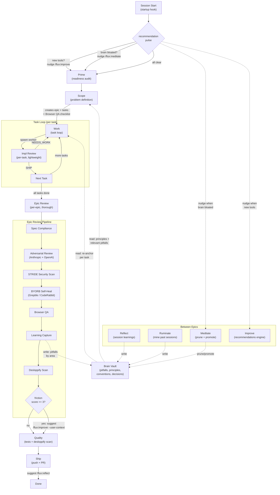

<div align="center">

# Flux

[](https://discord.gg/CEQMd6fmXk)
[](https://github.com/Nairon-AI/flux/releases)
[](LICENSE)
[](https://claude.ai/code)

**The missing harness for Claude Code.**<br>
Build software reliably (Self-improving)

</div>

## The Problem

You're using an AI coding agent, but something's off:

- **No structure** → You said "build me a dashboard" and came back to a mess of half-finished components
- **Context amnesia** → You've explained the auth flow three times this week. To the same agent.
- **Groundhog Day** → The agent tried the same broken import path five times in a row and you watched it happen
- **Tool FOMO** → You found out about Context7 after spending two hours debugging stale docs
- **Requirements drift** → You asked for a login page and got a full user management system with email verification
- **Blind acceptance** → You shipped the agent's suggestion without reading it. It's in production now. Good luck.
- **Security roulette** → Someone found the hardcoded API key the agent left in your config. On GitHub. Publicly.
- **Echo chamber** → The agent reviewed its own code, said "looks good", and you believed it
- **Long tasks implode** → 20 minutes into a complex refactor, the agent forgot what it was doing and started over
- **Flying blind** → You have no idea if you're getting better at this or just getting faster at making mistakes

<p align="center">
  
</p>

These aren't model failures. They're **process failures**.

**This is where Flux comes in.**

- **Repeatable workflows** — enforces structure across sessions so you and the agent never lose track of what's next
- **Multi-model adversarial reviews** — catches what no single model spots alone
- **Long tasks without drift** — Flux keeps the agent on rails even when context gets deep
- **Session analysis** — detect inefficiencies and get recommended optimisations from an engine that learns your patterns
- **Always up-to-date** — stays current with the latest harness and context engineering best practices so you can stop doom-scrolling

Ship with confidence. Sleep better at night.

---

## Contents

- [Install](#install)
- [Getting Started](#getting-started)
- [Core Workflow](#core-workflow)
- [Features](#features)
- [Commands](#commands)
- [Troubleshooting](#troubleshooting)
- [FAQ](#faq)
- [Roadmap](#roadmap)
- [Community](#community)

---

## Install

| Agent | Status | Install |
|-------|--------|---------|
| [Claude Code](https://claude.ai/code) | ✅ Recommended | `/plugin add https://github.com/Nairon-AI/flux@latest` |
| [OpenCode](https://github.com/anomalyco/opencode) | `[██████████░] 96%` | [flux-opencode](https://github.com/Nairon-AI/flux-opencode) |

**Install** — paste this into your agent:
```
Help me install the Flux plugin. Fetch the README at https://github.com/Nairon-AI/flux for install instructions.
```

**Upgrade** — paste this into your agent:
```
Help me upgrade the Flux plugin. Fetch the README at https://github.com/Nairon-AI/flux for upgrade instructions.
```

**Uninstall** — paste this into your agent:
```
Help me uninstall the Flux plugin. Fetch the README at https://github.com/Nairon-AI/flux for uninstall instructions.
```

After setup, just talk to the agent. Flux parses your message intent and routes to the right workflow — scope, work, review, or reflect — based on session state and what's currently in progress. You and the agent always know what's next.

> **Everything is project-local.** MCP servers go in `.mcp.json`, skills in `.claude/skills/`, config in `.flux/`. Nothing touches your global `~/.claude/settings.json`. No two projects need the same harness — different MCPs, skills, tools, and agentic patterns. Flux starts as a one-size-fits-all setup, then self-improves daily into the best harness for *that specific project*.

<details>
<summary><strong>Agent Instructions</strong> — the agent reads this section when it fetches the README</summary>

> **⚠️ Slash commands (`/plugin ...`) must be run by the user in the agent UI, not by you in bash.**

#### Install flow

1. Tell the user to run in their agent UI:
   ```
   /plugin add https://github.com/Nairon-AI/flux@latest
   ```
2. Tell the user to restart their agent/session with `--resume` to pick up where they left off.
3. After restart, run `/flux:setup` to scaffold `.flux/` and configure preferences.
4. If setup installs new MCP servers, tell the user to restart with `--resume` once more.
5. After restart, run `/flux:prime` if the repo hasn't been primed yet.

For **OpenCode**, use the [flux-opencode](https://github.com/Nairon-AI/flux-opencode) port instead.

#### Upgrade flow

The `/plugin update` command resolves from a stale marketplace cache. **Do not use it.**

1. Tell the user to run in their agent UI:
   ```
   /plugin uninstall flux@nairon-flux
   /plugin add https://github.com/Nairon-AI/flux@latest
   ```
2. Tell the user to restart their agent/session with `--resume`.
3. Run `/flux:setup` to refresh local scripts if needed.

#### Uninstall flow

1. Read `.flux/meta.json` for the `installed_by_flux` manifest to see what Flux added.
2. Ask the user per-category what to keep vs. remove (MCP servers, skills, desktop apps, CLI tools) — many aren't Flux-specific.
3. Tell the user to run in their agent UI:
   ```
   /plugin uninstall flux@nairon-flux
   ```
4. Remove project artifacts (the agent does this, not the user):
   ```bash
   rm -rf .flux .mcp.json .claude/skills/
   ```
5. Remove the `<!-- BEGIN FLUX -->` ... `<!-- END FLUX -->` section from CLAUDE.md and AGENTS.md.
6. Optionally remove plugin cache: `rm -rf ~/.claude/plugins/cache/nairon-flux`
7. Tell the user to restart with `--resume`.

</details>

---

## Getting Started

### 1. Setup

`/flux:setup` scaffolds `.flux/` in your project, configures your preferences, and optionally installs productivity tools. Everything is opt-in — you pick what you want.

<details>
<summary><b>What Flux offers to install</b></summary>

**MCP Servers** — extend what Claude can do:

| MCP | Why |
|-----|-----|
| [FFF](https://github.com/dmtrKovalenko/fff.nvim) | 10x faster file search — fuzzy, frecency-aware, git-status-aware (replaces default Glob/find) |
| [Context7](https://context7.com) | Up-to-date, version-specific library docs — no more hallucinated APIs |
| [Exa](https://exa.ai) | Fastest AI web search — real-time research without leaving your session |
| [GitHub](https://github.com/modelcontextprotocol/servers/tree/main/src/github) | PRs, issues, actions in Claude — no context switching to browser |
| [Supermemory](https://supermemory.ai) | Persistent memory across sessions — never re-explain context |
| [Firecrawl](https://firecrawl.dev) | Scrape websites and PDFs into clean markdown for agents |

**CLI Tools** — terminal essentials:

| Tool | Why |
|------|-----|
| [gh](https://cli.github.com) | GitHub from the terminal — PRs, issues, releases |
| [jq](https://jqlang.github.io/jq/) | JSON parsing for Flux internals |
| [fzf](https://github.com/junegunn/fzf) | Fuzzy finder for interactive selection |
| [Lefthook](https://github.com/evilmartians/lefthook) | Fast git hooks for pre-commit checks |
| [agent-browser](https://github.com/nichochar/agent-browser) | Headless browser for automated UI QA during epic reviews |
| [CLI Continues](https://github.com/nichochar/continues) | Session handoff — pick up where you left off across terminals |

**Desktop Apps** (macOS):

| App | Why |
|-----|-----|
| [Superset](https://superset.dev) | Parallel Claude sessions with git worktree workspace management |
| [Raycast](https://raycast.com) | Launcher with AI, snippets, clipboard history |
| [Wispr Flow](https://wisprflow.com) | Voice-to-text dictation — 4x faster than typing |
| [Granola](https://granola.ai) | AI meeting notes without a bot joining your calls |

**Agent Skills**:

| Skill | Why |
|-------|-----|
| [Claudeception](https://github.com/blader/Claudeception) | Continuous learning — extracts reusable knowledge from work sessions |

</details>

### 2. Prime

`/flux:prime` audits your codebase for agent readiness across 8 pillars and 48 criteria. It runs once per repo and Flux detects when it's needed.

### 3. Build

After prime, just tell the agent what you want — *build a feature, fix a bug, refactor something, continue work*. Flux uses repo state plus your message to decide whether to scope, resume, review, or hand off.

> **Why both Claude and Codex?** Flux works best with both a Claude and an OpenAI Codex subscription. During epic reviews, Flux runs adversarial dual-model review — two models with different training data review independently and consensus issues get auto-fixed. You can also bring your own review bot (Greptile, CodeRabbit) for a third perspective. See [Reviews](#reviews--two-tier-architecture) below.

---

## Core Workflow



| Phase | What happens |
|-------|-------------|
| **Session Start** | Startup hook injects brain vault index + workflow state. Recommendation pulse checks for new tools and brain vault health (once/day). |
| **Prime** | One-time readiness audit: 8 pillars, 48 criteria. Flux detects when needed. |
| **Scope** | Double Diamond interview: classify work, surface blind spots, create epic with sized tasks |
| **Work** | Task loop: spawn worker per task with fresh context, brain re-anchor, impl-review after each |
| **Review** | Per-task lightweight (`impl-review`), per-epic thorough (`epic-review` — adversarial, security, BYORB, browser QA, learning capture) |
| **Quality** | Tests, lint/format, desloppify scan on changed files |
| **Ship** | Push, open PR, suggest `/flux:reflect` |
| | |
| **Reflect** | *Between epics:* capture session learnings to brain vault. Suggested after every ship. |
| **Ruminate** | *Between epics:* mine past conversations for missed patterns |
| **Meditate** | *Between epics:* audit brain vault — prune stale notes, promote pitfalls to principles. Auto-nudged when 5+ new pitfalls accumulate or 30+ days since last meditation. |
| **Improve** | *On friction:* analyze sessions, recommend tools from the [recommendations engine](https://github.com/Nairon-AI/flux-recommendations). Auto-suggested on friction (score >= 3) and via session start pulse when new tools are available. |

---

## Features

### Deterministic State Engine

`.flux/` is the canonical workflow state. `session-state` tells Flux whether to prime, start fresh, resume scoping, resume implementation, or route to review. `brain/` is the persistent knowledge store — principles, pitfalls, conventions, and decisions. Startup hooks realign the agent with Flux state before acting on new requests.

### Built-in Agentmap

Flux generates YAML repo maps from git-tracked files for faster agent navigation.

```bash
fluxctl agentmap --write   # Writes .flux/context/agentmap.yaml
```

### Brain Vault — Single Knowledge Store

Flux's brain is an Obsidian-compatible vault (`brain/`) that serves as the single knowledge store for the entire system. Adapted from [brainmaxxing](https://github.com/poteto/brainmaxxing), it's wired into every core workflow:

- **Scoping** reads brain principles and pitfalls to ground research and plan structure
- **Worker** reads pitfalls (only from relevant area) and principles during re-anchor before each task
- **Epic review** writes learnings back to `brain/pitfalls/<area>/` after SHIP, categorized by domain
- **Meditate** promotes recurring pitfalls into proper principles and prunes one-offs

```
brain/
  principles/    # Engineering principles (curated via meditate)
  pitfalls/      # Auto-captured from review iterations, organized by area
    frontend/    #   e.g., missing-error-states.md
    security/    #   e.g., greptile-auth-gap.md
    async/       #   e.g., consensus-race-condition.md
  conventions/   # Project-specific patterns
  decisions/     # Architectural decisions with rationale
  plans/         # From scope/plan
```

```bash
/flux:reflect    # Capture session learnings to brain
/flux:ruminate   # Mine past conversations for missed patterns
/flux:meditate   # Prune stale notes, promote pitfalls → principles
```

These are maintenance skills designed to run between epics, not during active development. They audit, prune, and evolve the brain vault when you have breathing room.

### Self-Improving Harness

Flux autonomously finds ways to improve itself for every project it's used in. The recommendation engine surfaces at every natural touchpoint — not just when you ask for it:

| Touchpoint | What fires | How heavy |
|---|---|---|
| **Session start** | Recommendation pulse — checks for new tools and brain vault health | ~2s, once/day |
| **During work** | Qualitative friction analysis — detects frustration topic from developer messages | Zero cost |
| **After epic review** | Targeted `/flux:improve` suggestion with pre-filled friction context | Zero cost |
| **After shipping** | `/flux:reflect` suggestion to capture learnings | Zero cost |
| **Between epics** | Full `/flux:improve` analysis, `/flux:meditate` for brain pruning | Heavyweight |

The **recommendation pulse** runs as a startup hook every session (rate-limited to once per day). It pulls the latest [flux-recommendations](https://github.com/Nairon-AI/flux-recommendations) repo, checks for new tools that match your stack, and checks if your brain vault needs pruning. If anything is actionable, it surfaces a brief nudge — you multi-select to install or dismiss.

The **friction signal** fires during epic review using two layers: a quantitative friction score (review iterations, security findings, QA failures, repeated pitfalls) and qualitative analysis that scans developer messages and reviewer feedback to identify *what* you're struggling with. When the score hits 3+, Flux suggests `/flux:improve` with the friction domain pre-filled (e.g., `--user-context "responsive, CSS, mobile"`) so the recommendation engine skips discovery and goes straight to relevant tools.

The result: Flux gets smarter every session — new tools surface proactively, friction domains get diagnosed automatically, and the brain vault stays lean through meditate nudges. You don't have to remember to run maintenance commands.

### Desloppify

Systematic code quality improvement powered by [desloppify](https://github.com/peteromallet/desloppify). Combines mechanical detection with LLM-based review. The scoring system resists gaming — you can't suppress warnings, you have to actually fix the code.

When installed, Flux automatically runs a lightweight desloppify scan after epic review to surface quality regressions introduced during the epic. If the score drops below 85, it suggests a full fix pass.

```bash
/flux:desloppify scan     # See your score
/flux:desloppify next     # Get next priority fix
```

### Reviews — Two-Tier Architecture

Flux splits reviews into two tiers so you get fast feedback per-task without slowing down, and thorough verification per-epic before shipping.

**Per-task: Lightweight** (`/flux:impl-review`)
Single-model pass after each task. Catches obvious bugs, logic errors, and spec drift in seconds. Fast enough to run on every task without breaking flow.

**Per-epic: Thorough** (`/flux:epic-review`)
Full pipeline that runs once when all epic tasks are done:

| Phase | What happens |
|-------|-------------|
| Spec compliance | Verify every requirement from the epic spec is implemented |
| Adversarial review | Two models from different labs (Anthropic + OpenAI) review independently — consensus issues = high confidence |
| Severity filtering | Only auto-fix issues at/above your configured threshold (critical, major, minor, style) |
| Security scan | STRIDE-based vulnerability scan — auto-triggered when changes touch auth, API, secrets, or permissions |
| BYORB self-heal | Bring Your Own Review Bot — Greptile or CodeRabbit catch what models miss |
| Browser QA | Test acceptance criteria from scoping checklist via [agent-browser](https://github.com/AgnBc/agent-browser) |
| Learning capture | Extract patterns from review feedback into `brain/pitfalls/` |

> **Why adversarial?** A single model has blind spots. Two models from different labs (e.g., Claude + GPT) with different training data and biases catch issues that neither finds alone. When both models flag the same issue, it's almost certainly real. When only one does, Flux uses your severity threshold to decide whether to fix or log.

#### Security — Built Into the Review Pipeline

Security scanning is not a separate step you remember to run — it's baked into the epic review pipeline. When your changes touch security-sensitive files (auth, API routes, middleware, secrets, permissions), Flux automatically runs a [STRIDE](https://docs.microsoft.com/en-us/azure/security/develop/threat-modeling-tool-threats)-based scan adapted from [Factory AI](https://github.com/Factory-AI/factory-plugins). Findings are validated for exploitability (confidence >= 0.8 only), filtered by your severity threshold, and auto-fixed.

You can also run security tools standalone when needed:

```bash
/flux:threat-model           # Generate STRIDE threat model
/flux:security-scan PR #123  # Scan PR changes
/flux:security-review        # Full repository audit
```

#### BYORB — Bring Your Own Review Bot

Flux integrates with external code review bots that run on your PR. Configure during `/flux:setup`:

| Bot | How it works |
|-----|-------------|
| [Greptile](https://greptile.com) | Attaches a confidence summary to your PR description. Flux polls for it, parses the score and issue list, and auto-fixes issues above your severity threshold. |
| [CodeRabbit](https://coderabbit.ai) | Posts review comments on your PR. Flux polls for comments (or uses the CLI), parses issues, and auto-fixes above threshold. |

Bots catch patterns that LLMs miss — dependency conflicts, project-specific conventions, security rules from your org config. Combined with adversarial model review, you get three independent perspectives on every epic.

#### Browser QA — Scoping Creates the Test Plan

During `/flux:scope`, Flux detects frontend/web epics and auto-creates a **Browser QA Checklist** task with testable criteria (URLs, expected elements, user flows). At epic review time, `agent-browser` follows this checklist — no manual test plan needed.

#### Learning Capture — Reviews That Pay for Themselves

Every NEEDS_WORK iteration teaches Flux something. After reaching SHIP, Flux extracts generalizable patterns and writes them to `brain/pitfalls/`. The worker reads these during re-anchor at the start of every task. Over time, `/flux:meditate` promotes recurring pitfalls into proper principles and prunes one-offs — the brain gets smarter, not bigger.

**The result:** mistakes caught in review today are avoided in implementation tomorrow. Over time, you get fewer NEEDS_WORK iterations, shorter review cycles, and lower token spend — regardless of which review strategy you use. The learning feedback loop works with single-model, adversarial, or bot-assisted reviews.

```bash
/flux:setup   # Configure reviewers, bots, and severity threshold
```

### Linear Integration

Connect Flux to [Linear](https://linear.app) during `/flux:setup` — epics auto-create Linear projects, tasks auto-create issues, and status changes (start, done, block) sync in real-time. Your team gets full visibility without leaving Linear.

```bash
/flux:setup              # Select "Linear" when prompted for task tracker
fluxctl config get tracker.provider   # Check current tracker config
```

---

## Commands

**Core SDLC**

| Command | What it does | When it happens |
|---------|-------------|-----------------|
| `/flux:setup` | Initialize Flux in your project | 1. First time using Flux — scaffolds `.flux/`, configures preferences, installs tools |
| `/flux:prime` | Codebase readiness audit (8 pillars, 48 criteria) | 2. After setup — Flux detects unprimed repos and prompts you. Runs once per repo |
| `/flux:scope <idea>` | Guided scoping workflow (`--deep`, `--explore N`) | 3. You say "build me a dashboard" — Flux interviews you, creates an epic with sized tasks |
| `/flux:plan <idea>` | Create tasks only (skip interview) | 3. You already know exactly what to build — skip the Double Diamond interview, go straight to task creation |
| `/flux:work <task>` | Execute task with context reload | 4. After scoping — spawns a worker per task, each re-anchors from brain vault before implementing |
| `/flux:impl-review` | Lightweight per-task review (single model) | 5. Auto-triggered after each task completes inside `/flux:work` — you don't call this manually |
| `/flux:epic-review <epic>` | Thorough epic review (adversarial + BYORB + browser QA + learning + desloppify) | 6. Auto-triggered when all tasks in an epic are done — runs the full review pipeline before shipping |
| `/flux:sync <epic>` | Sync specs after drift | Anytime — you realized task 3 invalidated task 5's approach, sync updates downstream specs |
| `/flux:desloppify` | Code quality improvement (also runs as scan after epic review) | 7. After epic review flags a low score, or manually when you want to improve code quality |

**Security**

| Command | What it does | When it happens |
|---------|-------------|-----------------|
| `/flux:security-scan` | Scan for vulnerabilities | Auto-triggered inside epic review when changed files touch auth/API/secrets/permissions. Also callable standalone on any PR |
| `/flux:threat-model` | STRIDE-based threat model | Before building security-sensitive features — generates threat model to inform your design |
| `/flux:security-review` | Full security review | Before shipping to production — comprehensive repo-wide security audit |
| `/flux:vuln-validate` | Validate findings with PoC | After a scan finds issues — generates proof-of-concept exploits to confirm real vs false positive |

**Maintenance (between epics)**

| Command | What it does | When it happens |
|---------|-------------|-----------------|
| `/flux:reflect` | Capture session learnings to brain vault | 8. After shipping an epic — Flux suggests this so you capture learnings while context is fresh |
| `/flux:ruminate` | Mine past conversations for missed patterns | Between epics — when you have breathing room, mine old sessions for patterns you missed in the moment |
| `/flux:meditate` | Prune brain vault, promote pitfalls to principles | Auto-nudged at session start when 5+ new pitfalls accumulate or 30+ days since last meditation. Also run manually between epics |
| `/flux:improve` | Analyze sessions, recommend tools from the [recommendations engine](https://github.com/Nairon-AI/flux-recommendations) | Auto-nudged at session start when new tools available. Auto-suggested with pre-filled context when epic review detects friction (score >= 3) |

**Utilities**

| Command | What it does | When it happens |
|---------|-------------|-----------------|
| `/flux:score` | AI-native capability score | Anytime — benchmark your repo's AI-readiness |
| `/flux:profile` | Export/share SDLC profile | Anytime — share your Flux setup with teammates or the community |
| `/flux:contribute` | Report bug and auto-create fix PR | When you find a Flux bug — auto-creates a fix PR on the Flux repo |

Full reference: `docs/commands-reference.md`

### Prerequisites

Python 3.9+, jq, git. Flux checks for these during execution and tells you what's missing.

---

## Troubleshooting

> **AI Agents**: If you're debugging a Flux installation issue, follow these steps exactly. Do not guess.

<details>
<summary><strong>"Unknown skill: flux:setup"</strong></summary>

The plugin is registered but not enabled. Add to `~/.claude/settings.json`:

```bash
jq '.enabledPlugins["flux@nairon-flux"] = true' ~/.claude/settings.json > tmp.json && mv tmp.json ~/.claude/settings.json
```
Then restart Claude Code.
</details>

<details>
<summary><strong>Agent tried to run /plugin add in bash</strong></summary>

`/plugin` is a Claude Code slash command, not a shell command. Run it directly in the chat input, then restart.
</details>

<details>
<summary><strong>Commands still not working after enabling</strong></summary>

Clear cache and reinstall:
```bash
rm -rf ~/.claude/plugins/cache/nairon-flux ~/.claude/plugins/marketplaces/nairon-flux
```
Restart Claude Code, run `/plugin add https://github.com/Nairon-AI/flux@latest`, restart again.
</details>

<details>
<summary><strong>Old version / missing new commands</strong></summary>

```bash
rm -rf ~/.claude/plugins/cache/nairon-flux
```
Restart, run `/plugin add https://github.com/Nairon-AI/flux@latest`, restart again.
</details>

<details>
<summary><strong>"/plugin add" opens Discover tab instead of installing</strong></summary>

Run `/plugin marketplace add https://github.com/Nairon-AI/flux`, then `/plugin install flux@nairon-flux`, then restart.
</details>

<details>
<summary><strong>Nuclear option: complete reset</strong></summary>

```bash
rm -rf ~/.claude/plugins/cache/nairon-flux ~/.claude/plugins/marketplaces/nairon-flux
# Edit ~/.claude/plugins/installed_plugins.json — remove "nairon-flux" entries
# Edit ~/.claude/settings.json — remove "flux@nairon-flux" from enabledPlugins
```
Restart Claude Code, run `/plugin add https://github.com/Nairon-AI/flux@latest`, restart, run `/flux:setup`.
</details>

**Still stuck?** Join [Discord](https://discord.gg/CEQMd6fmXk) or open a [GitHub issue](https://github.com/Nairon-AI/flux/issues).

---

## FAQ

**What data does Flux read?**
Repo structure, installed MCPs, and optionally Claude Code session files (with consent).

**Is any data sent externally?**
Analysis runs locally. Network only used to fetch the recommendations repo.

**Can I use Flux with Beads?**
Not recommended — both are task tracking systems and will confuse the agent. Pick one.

---

## Roadmap

### Next — Relay

A fully autonomous orchestration layer for Flux. Heavily inspired by [OpenAI Symphony](https://github.com/openai/symphony).

Relay will coordinate multiple agents working in parallel across worktrees, manage task dependencies, and handle handoffs — so you can kick off a complex build, go for a walk, and come back to a PR. Human-in-the-loop when you want it, fully autonomous when you don't.

### Feature Roadmap

| Command | Enhancement |
|---------|-------------|
| `/flux:work` | Git worktree support for parallel development |
| `/flux:scope` | Meeting transcript ingestion |

### Universe Integration

Flux will sync to [Nairon Universe](https://nairon.ai/universe) — a public portal for AI-native engineers with profiles, benchmarks, and team dashboards.

*Coming Q2 2026.*

---

## Philosophy

1. **AI amplifies your skill level, it doesn't replace it.**
2. **Disagreement is a feature.** The best AI collaborators push back constantly.
3. **Process beats raw talent.** Structured approach > vibes-based prompting.
4. **What gets measured gets improved.** You can't fix what you can't see.
5. **The agent should do the work.** Analysis, installation — AI handles it. You decide.

---

## Community

No hype. No AI slop. Just practical discussions on becoming the strongest developers alive.

[discord.gg/CEQMd6fmXk](https://discord.gg/CEQMd6fmXk)

---

## Docs

- `docs/commands-reference.md` — Full command reference
- `docs/architecture.md` — How Flux works internally

---

## License

MIT

---

<p align="center">
  <em>Stop hoping AI makes you better. Start measuring it.</em>
</p>
