<div align="center">


[](https://discord.gg/CEQMd6fmXk)
[](https://github.com/Nairon-AI/flux/releases)
[](LICENSE)
[](https://github.com/openai/codex)

**The missing (self-improving) harness for Codex CLI.**<br>
Build software reliably.

> Recommended orchestrator: [SuperSet](https://superset.sh/) — parallel Codex sessions with git worktree isolation.

</div>

## The Problem

You're using an AI coding agent, but something's off:

- **No structure** → You said "build me a dashboard" and came back to a mess of half-finished components
- **Context amnesia** → You've explained the auth flow three times this week. To the same agent.
- **Groundhog Day** → The agent tried the same broken import path five times in a row and you watched it happen
- **Tool FOMO** → You found out about Context7 after spending two hours debugging stale docs
- **Requirements drift** → You asked for a login page and got a full user management system with email verification
- **Blind acceptance** → You shipped the agent's suggestion without reading it. It's in production now. Good luck.
- **Security roulette** → Someone found the hardcoded API key the agent left in your config. On GitHub. Publicly.
- **Echo chamber** → The same model you used to write the code, reviewed its own code, said "looks good", and you believed it (lmao)
- **Long tasks implode** → 20 minutes into a complex refactor, the agent forgot what it was doing and started over
- **Flying blind** → You have no idea if you're getting better at this or just getting faster at making mistakes
- **Sycophancy** → You described your idea and the agent said "brilliant approach, let me build that." It never said "this doesn't make sense" or "have you talked to users?" — it just validated you and started coding

<p align="center">
  
</p>

These aren't model failures. They're **process failures**.

**This is where Flux comes in.**

- **Repeatable workflows** — Enforces an Agent-first SDLC state machine during a session, so you and the agent never lose track of what's next while building (You can never build something before planning, skip code review, and so on)
- **Anti-sycophancy built in** — Flux will tell you "this isn't worth building" or "you're making assumptions you haven't validated." During scoping, it runs a viability gate and stress-tests one-way door decisions, UX assumptions, and deferred authority ("my senior said...") *before* any code is written
- **Multi-model adversarial reviews** — catches what no single model spots alone
- **Long tasks without drift** — Flux keeps the agent on rails even when context gets deep
- **Session analysis** — detect inefficiencies and get recommended optimisations from an engine that learns your patterns
- **Always up-to-date** — stays current with the latest harness and context engineering best practices so you can stop doom-scrolling

Ship with confidence. Sleep better at night.

---

## Contents

- [Install](#install)
- [Getting Started](#getting-started)
- [Architecture](#architecture)
- [Features](#features)
- [Commands](#commands)
- [Troubleshooting](#troubleshooting)
- [FAQ](#faq)
- [Roadmap](#roadmap)
- [Community](#community)

---

## Install

| Agent | Status | Install |
|-------|--------|---------|
| [Codex CLI](https://github.com/openai/codex) | ✅ Primary Driver | `Install Flux. README: https://github.com/Nairon-AI/flux` |
| [OpenCode](https://github.com/anomalyco/opencode) | `[████████░░░] ~80%` | [flux-opencode](https://github.com/Nairon-AI/flux-opencode) — brain vault, security suite, RCA, propose, gate ported |

**Flux install prompt** — use this with your agent:
```text
Install Flux. README: https://github.com/Nairon-AI/flux
```

After setup, just talk to the agent. Flux parses your message intent and routes to the right workflow — scope, work, review, or reflect — based on session state and what's currently in progress. Codex is the primary implementation path end-to-end.

> **Project-local setup lives in the repo.** MCP servers go in `.mcp.json`, repo instructions live in `AGENTS.md`, workflow state lives in `.flux/`, Flux-secured skills live in `.secureskills/`, and the brain vault lives in `.flux/brain/`. Flux is designed to run from the project checkout instead of depending on a Claude-specific global settings path.

---

## Getting Started

### 1. Setup

`/flux:setup` scaffolds `.flux/` in your project, configures your preferences, and optionally installs productivity tools. It also bootstraps [PlaTo](https://github.com/Alt5r/Plato) for project-local secure skill installs, so Flux can add supported skills through `secureskills` instead of dropping loose `SKILL.md` files into the repo. Everything is opt-in — you pick what you want.

<details>
<summary><b>What Flux offers to install</b></summary>

**MCP Servers** — extend what Codex can do:

| MCP | Why |
|-----|-----|
| [FFF](https://github.com/dmtrKovalenko/fff.nvim) | 10x faster file search — fuzzy, frecency-aware, git-status-aware (replaces default Glob/find) |
| [Context7](https://context7.com) | Up-to-date, version-specific library docs — no more hallucinated APIs |
| [Exa](https://exa.ai) | Fastest AI web search — real-time research without leaving your session |
| [GitHub](https://github.com/modelcontextprotocol/servers/tree/main/src/github) | PRs, issues, actions from the agent — no context switching to browser |
| [Firecrawl](https://firecrawl.dev) | Scrape websites and PDFs into clean markdown for agents |

**CLI Tools** — terminal essentials:

| Tool | Why |
|------|-----|
| [gh](https://cli.github.com) | GitHub from the terminal — PRs, issues, releases |
| [jq](https://jqlang.github.io/jq/) | JSON parsing for Flux internals |
| [fzf](https://github.com/junegunn/fzf) | Fuzzy finder for interactive selection |
| [Lefthook](https://github.com/evilmartians/lefthook) | Fast git hooks for pre-commit checks |
| [agent-browser](https://github.com/nichochar/agent-browser) | Headless browser for automated UI QA during epic reviews |
| [CLI Continues](https://github.com/nichochar/continues) | Session handoff — pick up where you left off across terminals |
| [React Doctor](https://www.react.doctor/) | Diff-scoped React code health scan with an opt-in pre-commit gate for changed files |
| [PlaTo](https://github.com/Alt5r/Plato) | Secure skill installer for Codex and Claude — signs and verifies project-local skills before runtime exposure |

**Desktop Apps** (macOS):

| App | Why |
|-----|-----|
| [Superset](https://superset.dev) | Parallel Codex sessions with git worktree workspace management |
| [CodexBar](https://github.com/steipete/CodexBar) | Menu bar visibility into Codex and Claude Code subscription usage and reset windows |
| [Raycast](https://raycast.com) | Launcher with AI, snippets, clipboard history |
| [Wispr Flow](https://wisprflow.com) | Voice-to-text dictation — 4x faster than typing |
| [Granola](https://granola.ai) | AI meeting notes without a bot joining your calls |

**Agent Skills** — optional project-local skill installs during `/flux:setup`, secured with PlaTo:

| Skill | Why |
|------|-----|
| [UI Skills](https://www.npmjs.com/package/ui-skills) | Accessibility, metadata, motion, and design polish for frontend output |
| [Dejank](https://github.com/gbasin/dejank) | React visual-jank audits: 18 anti-patterns plus runtime investigation workflows |
| [Taste Skill](https://github.com/Leonxlnx/taste-skill) | Reduce generic/sloppy UI generation |
| [Semver Changelog](https://skills.sh/prulloac/agent-skills/semver-changelog) | Structured changelog and release-note hygiene |
| [Find Skills (Vercel)](https://github.com/vercel-labs/agent-skills) | Secure bootstrap for Vercel's skill catalog, then add more through PlaTo |
| [X Research Skill](https://github.com/rohunvora/x-research-skill) | Summarize high-signal X threads for research |

`React Doctor` and `Dejank` are only offered when Flux detects a React-based repo during setup.
Selecting React Doctor during setup also wires an opt-in pre-commit hook so changed React code gets scanned before commit.
When React Doctor is available, Flux still uses it again in the quality pass for changed React code before submit.
Dejank stays the symptom-driven workflow: trigger it explicitly with `/flux:dejank` or by directly asking the agent to use `dejank`.
Casual React jank complaints like "this flickers" or "the layout jumps" should also route there automatically once Flux is installed in the repo.

</details>

### 2. Prime

`/flux:prime` audits your codebase for agent readiness across 8 pillars and 48 criteria. It runs once per repo and Flux detects when it's needed.

### 3. Build

After prime, just tell the agent what you want — *build a feature, fix a bug, refactor something, continue work*. Flux uses repo state plus your message to decide whether to scope, resume, review, or hand off.

> **Why keep Claude around at all?** Codex is Flux's primary driver for implementation, scouting, and day-to-day execution. Claude is optional and secondary: useful as the second lab in adversarial review, for cloud PR auto-fix, and for importing learnings from older transcript archives. During epic reviews, Flux runs dual-model review so two models with different training data review independently and consensus issues get auto-fixed. You can also bring your own review bot (Greptile, CodeRabbit) for a third perspective. See [Reviews](#reviews--two-tier-architecture) below.

---

## Architecture

```mermaid
flowchart TD
    SessionStart["Session Start<br/>(startup hook)"]
    Pulse{"recommendation<br/>pulse"}
    Prime["Prime<br/>(readiness audit)"]
    Propose["Propose<br/>(stakeholder intake)"]
    RCA["RCA<br/>(root cause analysis)"]
    Dejank["Dejank<br/>(React jank audit)"]
    Remember["Remember<br/>(memory router)"]
    Scope["Scope<br/>(problem definition)"]
    StressTest{"Stress Test<br/>(assumption dialectic)"}
    Work["Work<br/>(task loop)"]
    ImplReview["Impl Review<br/>(per-task, lightweight)"]
    EpicReview["Epic Review<br/>(per-epic, thorough)"]
    Grill["Grill<br/>(behavioral stress test)"]
    Quality["Quality<br/>(tests + desloppify scan)"]
    Submit["Submit<br/>(push + PR)"]
    Gate["Gate<br/>(staging validation)"]
    Autofix["Autofix<br/>(cloud PR babysitting)"]
    Reflect["Reflect<br/>(capture learnings)"]
    Meditate["Meditate<br/>(prune + promote)"]
    Ruminate["Ruminate<br/>(mine past sessions)"]
    Improve["Improve<br/>(recommendations engine)"]

    SessionStart --> Pulse
    Pulse -->|"new tools?<br/>nudge /flux:improve"| Prime
    Pulse -->|"all clear"| Prime
    Prime -->|"brain thin +<br/>past sessions exist"| Ruminate
    Prime -->|"brain ready"| Scope
    Ruminate -->|"bootstrap brain<br/>from history"| Scope
    SessionStart -->|"remember / don't forget"| Remember
    Remember -->|"stores to AGENTS.md<br/>or brain vault"| Scope
    Scope -->|"non-technical user<br/>detected"| Propose
    Propose -->|"creates proposal PR<br/>for engineering"| ProposeDone["Proposal Created"]
    Scope -->|"bug detected"| RCA
    Scope -->|"React jank complaint +<br/>Dejank installed"| Dejank
    Dejank -->|"static scan or runtime<br/>investigation"| Scope
    RCA -->|"fix + regression test<br/>+ pitfall written"| Submit
    Scope -->|"ambiguous domain<br/>terms detected"| UbiqLang["Ubiquitous Language<br/>(glossary extraction)"]
    UbiqLang -->|"glossary written<br/>to brain vault"| StressTest
    Scope -->|"problem defined"| StressTest
    StressTest -->|"one-way door /<br/>UX assumption /<br/>deferred authority"| StressTestRun["Spawn Opposing<br/>Subagents"]
    StressTest -->|"no tensions<br/>detected"| ExecChoice
    StressTestRun -->|"synthesize +<br/>user decides"| ExecChoice{"Execute how?"}
    StressTest -->|"complex module<br/>boundary"| DesignInterface["Design Interface<br/>(parallel sub-agents)"]
    DesignInterface -->|"interface chosen"| ExecChoice

    ExecChoice -->|"task-by-task<br/>(interactive)"| Work
    ExecChoice -->|"ralph mode<br/>(autonomous)"| Ralph["Ralph<br/>(autonomous harness)"]
    Ralph -->|"runs all tasks<br/>+ reviews unattended"| EpicReview

    subgraph task_loop ["Task Loop (per task)"]
        Work -->|"--tdd flag or<br/>spec requests TDD"| TDD["TDD Mode<br/>(red-green-refactor)"]
        TDD -->|"all cycles done"| ImplReview
        Work -->|"spawn worker"| ImplReview
        ImplReview -->|"NEEDS_WORK"| Work
        ImplReview -->|"SHIP"| FrictionCheck{"friction<br/>detected?"}
        FrictionCheck -->|"yes + not dismissed"| InlineImprove["Inline Recommend<br/>(install / skip / dismiss)"]
        InlineImprove --> NextTask["Next Task"]
        FrictionCheck -->|"no / dismissed"| NextTask
        NextTask -->|"more tasks"| Work
    end

    NextTask -->|"all tasks done"| EpicReview

    subgraph review_pipeline ["Epic Review Pipeline"]
        direction TB
        SpecCompliance["Spec Compliance"]
        Adversarial["Adversarial Review<br/>(Dual-Model Consensus)"]
        SecurityScan["STRIDE Security Scan"]
        BotSelfHeal["BYORB Self-Heal<br/>(Greptile / CodeRabbit)<br/><i>optional</i>"]
        BrowserQA["Browser QA"]
        LearningCapture["Learning Capture"]
        DesloppifyScan["Desloppify Scan"]
        FrustrationSignal{"friction<br/>score >= 3?"}

        SpecCompliance --> Adversarial
        Adversarial --> SecurityScan
        SecurityScan --> BotSelfHeal
        SecurityScan -->|"no bot configured"| BrowserQA
        BotSelfHeal --> BrowserQA
        BrowserQA --> LearningCapture
        LearningCapture --> DesloppifyScan
        DesloppifyScan --> FrustrationSignal
    end

    EpicReview --> SpecCompliance
    FrustrationSignal -->|"no"| GrillOffer{"offer grill?<br/>(5+ tasks)"}
    GrillOffer -->|"user accepts"| Grill
    GrillOffer -->|"skip"| Quality
    Grill -->|"gaps found → new tasks"| Work
    Grill -->|"all verified"| Quality
    FrustrationSignal -->|"yes: auto-fetch<br/>recommendations +<br/>offer installs"| GrillOffer
    Quality --> Submit
    Submit -.->|"after merge to staging"| Gate
    Submit -->|"autofix.enabled"| Autofix
    Autofix -->|"non-blocking<br/>remote session"| Reflect
    Submit -->|"!autofix +<br/>review.bot set"| BYORB_Post["BYORB<br/>(local bot self-heal)"]
    BYORB_Post --> Reflect
    Submit -->|"neither"| Reflect
    Reflect -->|"20+ pitfall files"| Meditate
    Reflect -->|"brain healthy"| Done["Done"]
    Gate -->|"promotion ready"| Done
    Meditate --> Done

    Brain["Brain Vault<br/>(pitfalls, principles,<br/>conventions, decisions)"]

    Brain -.->|"read: principles +<br/>relevant pitfalls"| Scope
    Brain -.->|"read: re-anchor<br/>per task"| Work
    LearningCapture -.->|"write: pitfalls<br/>by area"| Brain
    Reflect -.->|"write: learnings<br/>+ skills"| Brain
    Ruminate -.->|"write: mined<br/>patterns"| Brain
    Meditate -.->|"prune/promote"| Brain
    UbiqLang -.->|"write: glossary"| Brain
    Grill -.->|"write: decisions<br/>+ new tasks"| Brain
    Pulse -.->|"nudge when<br/>new tools"| Improve
```



The diagram above shows the primary SDLC loop plus the main auxiliary routes (`/flux:remember`, `/flux:dejank`, `/flux:gate`). Flux also tracks router metadata for the utility and maintainer commands outside that loop. `fluxctl session-state --json` now returns the active router `command`, `skill`, and architecture `node`, and the full command-to-node catalog lives in [docs/state-machine.md](docs/state-machine.md).

Flux also has a small set of **workflow-embedded utility skills** that are part of the architecture even though they are not slash commands or router targets:

- `flux-parallel-dispatch` — applied when Prime or Scope needs safe parallel fan-out
- `flux-receive-review` — applied when Impl Review, Epic Review, or Autofix handles reviewer/bot feedback
- `flux-verify-claims` — applied before Work/Review/Autofix claims fixed, green, SHIP, or done

These utility skills run *inside* the owning phase rather than creating a new top-level state or command.

| Phase | What happens | Why it exists |
|-------|-------------|---------------|
| **Session Start** | Startup hook injects brain vault index + workflow state. Recommendation pulse checks for new tools and brain health (once/day). | Without this, every session starts from zero — the agent doesn't know what it learned yesterday, what work is in progress, or what the project's conventions are. The hook gives it continuity. |
| **Prime** | One-time readiness audit: 8 pillars, 48 criteria. | Agents routinely skip foundational setup (testing, CI, linting, security) and jump straight to features. Prime forces a baseline before any real work starts, catching gaps that would otherwise surface as bugs weeks later. |
| **Ruminate** | *Auto after Prime (conditional):* mines past session transcripts to bootstrap the brain vault. Triggers when brain has < 5 files and past sessions exist. | You've already taught the agent things in prior sessions — corrections, preferences, domain knowledge — but that knowledge dies with each session. Ruminate recovers it so you don't repeat yourself. Only runs once when the brain is empty. |
| **Propose** | Stakeholder feature proposal: conversational planning with deep codebase investigation, honest time estimates, and engineering pushback — all presented in plain language a non-technical founder can skim. Supports Google Doc import. Updates business context automatically. | Non-technical team members describe features without implementation detail. Without Propose, vague requests go straight to engineering as ambiguous tickets — and "just remove credits" gets treated as a quick fix when it's actually a 2-week overhaul. Propose does a real technical investigation and gives honest estimates, so stakeholders understand the true cost before engineering time is spent. |
| **RCA** | Bug-specific flow: backward trace from symptom to root cause, adversarial verification, regression test, embedded learnings. | Agents fix symptoms, not causes. They'll patch the crash without understanding why it crashed. RCA forces backward tracing from symptom → root cause, mandates regression tests, and writes a pitfall so the same class of bug is caught earlier next time. |
| **Scope** | Double Diamond interview: classify work, surface blind spots, run a viability gate ("should we build this?"), stress-test assumptions, create epic with sized tasks. After scoping, choose execution mode: **task-by-task** (interactive `/flux:work`) or **Ralph mode** (autonomous — runs all tasks + reviews unattended). | Agents start building the moment you describe a feature — they never say "this doesn't make sense" or "have you talked to users?" Without scoping, they miss edge cases, build the wrong thing, or validate bad ideas. The interview catches blind spots before a single line of code is written. The viability gate is the anti-sycophancy mechanism — it will tell you not to build something if the evidence doesn't support it. |
| **Ubiquitous Language** | *Auto during Scope (conditional):* When ambiguous domain terms are detected during scoping, extracts a DDD-style glossary — picks canonical terms, flags ambiguities, lists aliases to avoid. Writes to `.flux/brain/business/glossary.md`. | Developers and domain experts use different words for the same concept. "Account" means one thing to support and another to engineering. Without a shared glossary, bugs hide in the translation. This catches terminological drift before it becomes architectural drift. |
| **Design Interface** | *Auto during Scope (conditional):* When scoping identifies a complex module boundary or multiple viable interface approaches, spawns 3+ parallel sub-agents with different design constraints (minimize methods, maximize flexibility, optimize common case). Compares and recommends. Parallel fan-out should follow `flux-parallel-dispatch`. | Your first interface idea is rarely the best. "Design It Twice" (from *A Philosophy of Software Design*) ensures you see radically different approaches before committing to one. The parallel sub-agents prevent anchoring bias — each starts fresh with a different constraint. |
| **Stress Test** | *Auto during Scope:* spawns two opposing subagents to argue both sides of detected tensions (architecture choices, UX assumptions, deferred authority). Synthesizes a recommendation that transforms the question — not compromise, reconceptualization. | Developers make one-way door decisions on autopilot — auth strategy, data model, API contracts — based on assumptions they haven't examined. "My senior said X" or "users probably want Y" become load-bearing beliefs that are expensive to reverse. The stress test catches these *before* any code is written, when changing direction costs nothing. Inspired by the [Electric Monks](https://github.com/KyleAMathews/hegelian-dialectic-skill) dialectic pattern. |
| **TDD** | *During Work (optional):* Red-green-refactor vertical slices. Write ONE test (RED), write minimal code to pass (GREEN), repeat. Refactor only after all tests pass. Activated by `--tdd` flag, task spec mentioning TDD, or user request. | Agents write tests in bulk then implement in bulk — "horizontal slicing." This produces tests that verify imagined behavior, not actual behavior. Vertical slicing forces each test to respond to what was learned from the previous cycle, producing tests that actually catch regressions. |
| **Work** | Task loop: spawn worker per task with fresh context, brain re-anchor, impl-review after each. Codex is the recommended implementation engine; after each task, Flux checks for friction signals (build errors, lint failures, API hallucinations) and offers targeted tool recommendations inline — install, skip, or snooze for 7 days. Snoozed signals automatically resurface to check for new tooling. In Ralph mode, this loop runs autonomously without stopping. | Long tasks degrade agent quality — context bloats, the agent forgets constraints, output gets sloppy. Fresh workers per task keep context tight. Inline friction detection catches recurring pain points *during* the build, not after — so you can unblock immediately instead of suffering through an entire epic before getting a recommendation. |
| **Review** | Per-task lightweight (`impl-review`), per-epic thorough (`epic-review` — adversarial, security, BYORB *optional*, browser QA, learning capture). Review handling uses `flux-receive-review` to interpret reviewer/bot comments before code changes and `flux-verify-claims` before advancing to SHIP. Manual review findings can also be structuralized: if the developer confirms a repeatable anti-pattern, Flux can route it toward a project rule candidate (for example a `lintcn` rule). Codex handles the primary review backend; Claude is still a strong adversarial reviewer in cross-lab pairings. | Self-review is unreliable — the same model that wrote the code reviews it. Adversarial review (multiple models reaching consensus) catches what single-model review misses. BYORB (Greptile, CodeRabbit, etc.) is optional — skipped if no bot is configured. Browser QA catches what code review can't see at all. |
| **Grill** | *After Epic Review (offered for 5+ task epics):* Relentless behavioral stress test — walks every branch of the decision tree, verifying implemented behavior matches intent. Finds gaps the spec didn't mention but users will encounter. Can create new tasks if gaps are found. | Epic review checks code quality — but code can be perfect and still do the wrong thing. Grill checks *behavioral correctness*: does the implementation match what was intended? It's the difference between "the code compiles" and "the feature works." Especially valuable for large epics where requirements can drift across many tasks. |
| **Quality** | Tests, repo-defined lint/format gates (for example `lintcn`), optional `react-doctor` diff scan for React changes as a backstop after the pre-commit hook, desloppify scan on changed files. | Agents skip tests, ignore lint errors, and leave dead code. Quality is the gate before Submit — nothing ships without passing. |
| **Submit** | Push + open PR. Code is ready for review/merge. | Separates "code is done" from "code is shipped." The PR is the handoff point where human reviewers and CI take over. |
| **Autofix** | *Automatic after Submit (config-driven):* optional Anthropic-backed cloud PR babysitting after the main Codex implementation path is done. Non-blocking — Reflect runs independently. Enabled via `/flux:setup`. | CI failures and review comments are the #1 reason PRs sit idle. Auto-fix handles the mechanical back-and-forth after shipping, while keeping core implementation and review Codex-first. |
| **Reflect** | *Auto after Submit/Autofix:* captures session learnings to brain vault, extracts reusable skills, and routes confirmed recurring review findings into structural prevention where appropriate (lint rules, guards, scripts) while context is fresh. | The agent just spent an entire session learning your codebase, hitting bugs, getting corrected. If you don't capture those learnings *now*, they're gone — the next session starts from scratch. Reflect is the difference between an agent that gets smarter over time and one that makes the same mistakes forever. |
| **Meditate** | *Auto after Reflect (conditional):* prunes stale notes, promotes pitfalls to principles. Triggers when 20+ pitfall files accumulate. | The brain vault grows without bound. Old pitfalls become irrelevant (code was refactored), recurring patterns deserve promotion to principles (stronger signal). Without periodic curation, the brain becomes noise — too many files, contradictory advice, stale warnings about code that no longer exists. |
| **Ship** | PR merged + deployed. | Happens outside Flux's session scope — CI/CD, human review, merge. Flux's job ends at Submit. |
| **Gate** | *After staging merge:* verifies staging deployment is live, runs browser QA or manual review against staging URL, then creates promotion PR (staging → production). | Code that passes CI can still break in staging — env variables differ, APIs behave differently, CDN caching causes stale assets. Gate is the checkpoint between "code compiles" and "code actually works in a real environment." Without it, production deploys are a leap of faith. |
| **Improve** | *Inline:* after each task, friction signals trigger a targeted recommendation (install / skip / snooze). Snoozed signals enter a 7-day cooldown, then resurface: "It's been a week — want to check for new optimizations?" *Epic-level (score >= 3):* recommendations matched to your friction patterns. | When the same friction keeps recurring, the problem isn't the code — it's a missing tool. Inline detection catches it during the build so you can unblock immediately. The 7-day cooldown prevents recommendation fatigue while still giving the ecosystem time to develop new tooling — what had no good fix last week might have one today. |

### What's Automatic vs Manual

| Action | Trigger | Type |
|--------|---------|------|
| **Session start hook** | Every session | Automatic — injects brain vault index + workflow state |
| **Recommendation pulse** | Every session (rate-limited 1x/day) | Automatic — nudges for new tools, brain vault health |
| **`session-state` routing** | Before any work-like request | Automatic — routes to prime/scope/work/review |
| **Reflect** | After PR is submitted | Automatic — captures learnings while context is fresh |
| **Meditate** | After Reflect, if 20+ pitfall files | Automatic — prunes stale, promotes patterns |
| **Ruminate** | After Prime, if brain thin + past sessions exist | Automatic — bootstraps brain from conversation history |
| **Stress Test** | During scope, if one-way door / UX assumption / deferred authority detected | Automatic — spawns opposing subagents, synthesizes recommendation |
| **Ubiquitous Language** | During scope, if ambiguous domain terms detected | Automatic — extracts glossary to brain vault |
| **Design Interface** | During scope, if complex module boundary detected | Automatic — spawns parallel sub-agents with different design constraints |
| **Parallel Dispatch utility** | During Prime scouts or Scope explore fan-out | Automatic — uses `flux-parallel-dispatch` to keep parallel work isolated and intentional |
| **TDD** | During work, if `--tdd` flag or task spec requests it | Automatic — switches worker to red-green-refactor vertical slices |
| **Verify Claims utility** | During work/review/autofix before fixed/green/done claims | Automatic — uses `flux-verify-claims` inside the owning phase |
| **Receive Review utility** | During impl-review/epic-review/autofix comment handling | Automatic — uses `flux-receive-review` inside the owning phase |
| **Grill** | After epic review, for epics with 5+ tasks | Semi-automatic — offered to user, strongly recommended for large epics |
| **Autofix** | After PR is submitted, if enabled in setup | Automatic — config-driven, non-blocking cloud PR babysitting |
| **Improve** | During epic review, if friction score >= 3 | Automatic — fetches and matches recommendations |
| **Setup** (`/flux:setup`) | First install; re-run after major upgrades | Manual — Flux nudges if setup version is stale after upgrade |
| **Prime** (`/flux:prime`) | First session per project | Manual — but `session-state` blocks until done |
| **Scope** (`/flux:scope`) | Start new work | Manual |
| **Work** (`/flux:work`) | Execute a plan task-by-task | Manual |
| **Ralph** (`/flux:ralph-init`) | Execute an entire epic autonomously | Manual — offered after scoping |
| **Upgrade** (`/flux:upgrade`) | Get latest Flux version | Manual |
| **Gate** (`/flux:gate`) | Validate staging after merge | Manual (or CI auto) |

After upgrading, if your project's setup version is behind the plugin version, Flux will nudge you to re-run `/flux:setup` to pick up new configuration options.

---

## Features

### Deterministic State Engine

`.flux/` is the canonical workflow state. `session-state` tells Flux whether to prime, start fresh, resume scoping, resume implementation, or route to review. `.flux/brain/` is the canonical persistent knowledge store — principles, pitfalls, conventions, and decisions. Startup hooks realign the agent with Flux state before acting on new requests.

The full state machine is formally defined in [`docs/state-machine.md`](docs/state-machine.md) — every state, valid transition, routing rule, and guard is documented. Users and agents can query `fluxctl session-state --json` at any point to see exactly where they are in the workflow.

### Built-in Agentmap

Flux generates YAML repo maps from git-tracked files for faster agent navigation.

```bash
fluxctl agentmap --write   # Writes .flux/context/agentmap.yaml
```

### Brain Vault — Single Knowledge Store

Flux's brain is an Obsidian-compatible vault stored in `.flux/brain/`. Adapted from [brainmaxxing](https://github.com/poteto/brainmaxxing), it's wired into every core workflow:

- **Scoping** reads brain principles, pitfalls, and business context to ground research and plan structure
- **Architecture-aware flows** read `.flux/brain/codebase/architecture.md` as the canonical high-level system diagram during scope, work, and review
- **Propose** reads business context and glossary, does a real codebase investigation, then writes back new domain terms and area-specific context learned during the session
- **Worker** reads pitfalls (only from relevant area) and principles during re-anchor before each task
- **Epic review** writes learnings back to `.flux/brain/pitfalls/<area>/` after SHIP, categorized by domain
- **Meditate** promotes recurring pitfalls into proper principles, prunes one-offs, and audits business context for stale facts

```
.flux/brain/
  business/      # Business context (populated during setup, enriched by propose)
    context.md   #   Product stage, team structure, key context
    glossary.md  #   Ubiquitous language — domain-specific terms
    billing.md   #   Area-specific: how billing works, key decisions (auto-created)
  principles/    # Engineering principles (curated via meditate)
  pitfalls/      # Auto-captured from review iterations, organized by area
    frontend/    #   e.g., missing-error-states.md
    security/    #   e.g., greptile-auth-gap.md
    async/       #   e.g., consensus-race-condition.md
  conventions/   # Project-specific patterns
  codebase/      # Canonical repo-level diagrams and technical notes
    architecture.md # High-level Mermaid system diagram used by scope/work/review
  decisions/     # Architectural decisions with rationale
  plans/         # From scope/plan
```

**Natural language memory**: Just say "remember X" and Flux routes it to the right place — `AGENTS.md` for short rules the agent needs every session, or `.flux/brain/` for deeper context and decisions.

```bash
/flux:reflect    # Capture session learnings + extract reusable skills
/flux:ruminate   # Mine past conversations for missed patterns
/flux:meditate   # Prune stale notes, promote pitfalls → principles
```

These are maintenance skills designed to run between epics, not during active development. They audit, prune, and evolve the brain vault when you have breathing room.

### Self-Improving Harness

Flux autonomously finds ways to improve itself for every project it's used in. The recommendation engine surfaces tools matched to friction patterns at every natural touchpoint — not just when you ask for it:

| Touchpoint | What fires | How heavy |
|---|---|---|
| **Session start** | Recommendation pulse — checks for new tools and brain vault health | ~2s, once/day |
| **During work** | Qualitative friction analysis — detects frustration topic from developer messages | Zero cost |
| **After epic review** | Targeted `/flux:improve` suggestion with pre-filled friction context | Zero cost |
| **After shipping** | `/flux:reflect` suggestion to capture learnings | Zero cost |
| **Between epics** | Full `/flux:improve` analysis, `/flux:meditate` for brain pruning | Heavyweight |

The **recommendation pulse** runs as a startup hook every session (rate-limited to once per day). It checks for new recommendations matched to your stack. If anything is actionable, it surfaces a brief nudge — you multi-select to install or dismiss.

The **friction signal** fires during epic review using two layers: a quantitative friction score (review iterations, security findings, QA failures, repeated pitfalls) and qualitative analysis that scans developer messages and reviewer feedback to identify *what* you're struggling with. When the score hits 3+, Flux suggests `/flux:improve` with the friction domain pre-filled (e.g., `--user-context "responsive, CSS, mobile"`) so the recommendation engine skips discovery and goes straight to relevant tools.

The result: Flux gets smarter every session — new tools surface proactively, friction domains get diagnosed automatically, and the brain vault stays lean through meditate nudges. You don't have to remember to run maintenance commands.

### Desloppify

Systematic code quality improvement powered by [desloppify](https://github.com/peteromallet/desloppify). Combines mechanical detection with LLM-based review. The scoring system resists gaming — you can't suppress warnings, you have to actually fix the code.

When installed, Flux automatically runs a lightweight desloppify scan after epic review to surface quality regressions introduced during the epic. In React repos where React Doctor is available, Flux also runs a diff-scoped React Doctor pass during quality before submit. If the desloppify score drops below 85, it suggests a full fix pass.

```bash
/flux:desloppify scan     # See your score
/flux:desloppify next     # Get next priority fix
```

### Reviews — Two-Tier Architecture

Flux splits reviews into two tiers so you get fast feedback per-task without slowing down, and thorough verification per-epic before shipping.

**Per-task: Lightweight** (`/flux:impl-review`)
Single-model pass after each task. Catches obvious bugs, logic errors, and spec drift in seconds. Fast enough to run on every task without breaking flow.

**Per-epic: Thorough** (`/flux:epic-review`)
Full pipeline that runs once when all epic tasks are done:

| Phase | What happens |
|-------|-------------|
| Spec compliance | Verify every requirement from the epic spec is implemented |
| Adversarial review | Two different models review independently — cross-lab pairs (Anthropic + OpenAI) are strongest but same-provider pairs work too. Consensus issues = high confidence |
| Severity filtering | Only auto-fix issues at/above your configured threshold (critical, major, minor, style) |
| Security scan | STRIDE-based vulnerability scan — auto-triggered when changes touch auth, API, secrets, or permissions |
| BYORB self-heal | Bring Your Own Review Bot — Greptile or CodeRabbit catch what models miss |
| Browser QA | Test acceptance criteria from scoping checklist via [agent-browser](https://github.com/AgnBc/agent-browser) |
| Learning capture | Extract patterns from review feedback into `.flux/brain/pitfalls/` |

> **Why adversarial?** A single model has blind spots. Two different models (for example Codex + Claude) catch issues that neither finds alone. Cross-lab pairs are strongest since different training data eliminates shared biases, but same-provider pairs still add value. When both models flag the same issue, it's almost certainly real. When only one does, Flux uses your severity threshold to decide whether to fix or log.

#### Security — Built Into the Review Pipeline

Security scanning is not a separate step you remember to run — it's baked into the epic review pipeline. When your changes touch security-sensitive files (auth, API routes, middleware, secrets, permissions), Flux automatically runs a [STRIDE](https://docs.microsoft.com/en-us/azure/security/develop/threat-modeling-tool-threats)-based scan adapted from [Factory AI](https://github.com/Factory-AI/factory-plugins). Findings are validated for exploitability (confidence >= 0.8 only), filtered by your severity threshold, and auto-fixed.

You can also run security tools standalone when needed:

```bash
/flux:threat-model           # Generate STRIDE threat model
/flux:security-scan PR #123  # Scan PR changes
/flux:security-review        # Full repository audit
```

#### BYORB — Bring Your Own Review Bot

Flux integrates with external code review bots that run on your PR. Configure during `/flux:setup`:

| Bot | How it works |
|-----|-------------|
| [Greptile](https://greptile.com) | Attaches a confidence summary to your PR description. Flux polls for it, parses the score and issue list, and auto-fixes issues above your severity threshold. |
| [CodeRabbit](https://coderabbit.ai) | Posts review comments on your PR. Flux polls for comments (or uses the CLI), parses issues, and auto-fixes above threshold. |

Bots catch patterns that LLMs miss — dependency conflicts, project-specific conventions, security rules from your org config. Combined with adversarial model review, you get three independent perspectives on every epic.

#### Browser QA — Scoping Creates the Test Plan

During `/flux:scope`, Flux detects frontend/web epics and auto-creates a **Browser QA Checklist** task with testable criteria (URLs, expected elements, user flows). At epic review time, `agent-browser` follows this checklist — no manual test plan needed.

#### Learning Capture — Reviews That Pay for Themselves

Every NEEDS_WORK iteration teaches Flux something. After reaching SHIP, Flux extracts generalizable patterns and writes them to `.flux/brain/pitfalls/`. The worker reads these during re-anchor at the start of every task. Over time, `/flux:meditate` promotes recurring pitfalls into proper principles and prunes one-offs — the brain gets smarter, not bigger.

**The result:** mistakes caught in review today are avoided in implementation tomorrow. Over time, you get fewer NEEDS_WORK iterations, shorter review cycles, and lower token spend — regardless of which review strategy you use. The learning feedback loop works with single-model, adversarial, or bot-assisted reviews.

```bash
/flux:setup   # Configure reviewers, bots, and severity threshold
```

### Linear Integration

Connect Flux to [Linear](https://linear.app) during `/flux:setup` — epics auto-create Linear projects, tasks auto-create issues, and status changes (start, done, block) sync in real-time. Your team gets full visibility without leaving Linear.

```bash
/flux:setup              # Select "Linear" when prompted for task tracker
fluxctl config get tracker.provider   # Check current tracker config
```

---

## Commands

**Core SDLC**

| Command | What it does | When it happens |
|---------|-------------|-----------------|
| `/flux:setup` | Initialize Flux in your project | 1. First time using Flux — scaffolds `.flux/`, configures preferences, installs tools |
| `/flux:prime` | Codebase readiness audit (8 pillars, 48 criteria) | 2. After setup — Flux detects unprimed repos and prompts you. Runs once per repo |
| `/flux:propose` | Stakeholder feature proposal with engineering pushback | 2.5. A non-technical teammate describes a feature — Flux interviews them, pushes back on complexity/cost, documents the proposal, and creates a PR for engineering handoff. Also detected implicitly during `/flux:scope` |
| `/flux:rca` | Root cause analysis for bugs | 2.5. You paste an error or describe a bug — Flux traces backward to the root cause, verifies with adversarial review, writes the fix with regression test, and embeds learnings. Also detected implicitly during `/flux:scope` |
| `/flux:scope <idea>` | Guided scoping workflow (`--deep`, `--explore N`) | 3. You say "build me a dashboard" — Flux interviews you, creates an epic with sized tasks |
| `/flux:plan <idea>` | Create tasks only (skip interview) | 3. You already know exactly what to build — skip the Double Diamond interview, go straight to task creation |
| `/flux:work <task>` | Execute task with context reload | 4. After scoping — spawns a worker per task, each re-anchors from brain vault before implementing |
| `/flux:impl-review` | Lightweight per-task review (single model) | 5. Auto-triggered after each task completes inside `/flux:work` — you don't call this manually |
| `/flux:epic-review <epic>` | Thorough epic review (adversarial + BYORB + browser QA + learning + desloppify) | 6. Auto-triggered when all tasks in an epic are done — runs the full review pipeline before shipping |
| `/flux:dejank [target or symptom]` | React visual-jank audit via the optional Dejank skill | Anytime in React repos after installing Dejank through `/flux:setup` — investigate flicker, layout shift, flashes, or run a preventive scan |
| `/flux:grill` | Behavioral stress test — walk every decision branch, verify behavior matches intent | 6.5. Offered after epic review for epics with 5+ tasks. Also callable standalone ("grill me") to stress-test any implemented feature |
| `/flux:tdd` | Test-driven development with red-green-refactor vertical slices | During `/flux:work` — activated by `--tdd` flag, task spec, or user request. Also callable standalone for any feature or bugfix |
| `/flux:design-interface` | Generate 3+ radically different interface designs via parallel sub-agents, compare, and recommend | During `/flux:scope` — auto-triggered when complex module boundaries are detected. Also callable standalone when designing any module API |
| `/flux:ubiquitous-language` | Extract DDD glossary from conversation + codebase, write to brain vault | During `/flux:scope` — auto-triggered when ambiguous domain terms are detected. Also callable standalone to formalize domain terminology |
| `/flux:export-context` | Export a review pack for external LLMs like ChatGPT or Claude web | Anytime you want off-platform review while preserving Flux context selection |
| `/flux:autofix` | Start Claude cloud auto-fix on a submitted PR | After submit — manually or automatically when configured in `/flux:setup` |
| `/flux:remember` | Persist a repo rule or durable context into AGENTS.md or the brain vault | Anytime the user says "remember", "don't forget", "keep in mind", or wants an explicit memory write |
| `/flux:sync <epic>` | Sync specs after drift | Anytime — you realized task 3 invalidated task 5's approach, sync updates downstream specs |
| `/flux:desloppify` | Code quality improvement (also runs as scan after epic review) | 7. After epic review flags a low score, or manually when you want to improve code quality |
| `/flux:gate` | Validate staging after merge and promote toward production | After a merge lands on staging and you want Flux to verify before promotion |

**Security**

| Command | What it does | When it happens |
|---------|-------------|-----------------|
| `/flux:security-scan` | Scan for vulnerabilities | Auto-triggered inside epic review when changed files touch auth/API/secrets/permissions. Also callable standalone on any PR |
| `/flux:threat-model` | STRIDE-based threat model | Before building security-sensitive features — generates threat model to inform your design |
| `/flux:security-review` | Full security review | Before shipping to production — comprehensive repo-wide security audit |
| `/flux:vuln-validate` | Validate findings with PoC | After a scan finds issues — generates proof-of-concept exploits to confirm real vs false positive |

**Maintenance (between epics)**

| Command | What it does | When it happens |
|---------|-------------|-----------------|
| `/flux:reflect` | Capture session learnings to brain vault and extract reusable skills | 8. After shipping an epic — Flux suggests this so you capture learnings while context is fresh |
| `/flux:ruminate` | Mine past conversations for missed patterns | Between epics — when you have breathing room, mine old sessions for patterns you missed in the moment |
| `/flux:meditate` | Prune brain vault, promote pitfalls to principles | Auto-nudged at session start when 5+ new pitfalls accumulate or 30+ days since last meditation. Also run manually between epics |
| `/flux:improve` | Analyze sessions, recommend tools from the recommendation engine | Auto-nudged at session start when new tools available. Auto-suggested with pre-filled context when epic review detects friction (score >= 3). Also triggered naturally — just say "find me tools for growth engineering" or "what can help with testing" and Flux routes to improve automatically |

**Utilities**

| Command | What it does | When it happens |
|---------|-------------|-----------------|
| `/flux:score` | AI-native capability score | Anytime — benchmark your repo's AI-readiness |
| `/flux:profile` | Export/share SDLC profile | Anytime — share your Flux setup with teammates or the community |
| `/flux:contribute` | Report bug and auto-create fix PR | When you find a Flux bug — auto-creates a fix PR on the Flux repo |
| `/flux:release` | Cut a Flux release and keep manifests in sync | Flux-maintainer workflow for publishing a new version |
| `/flux:improve-claude-md` | Restructure AGENTS.md/CLAUDE.md with stronger conditional blocks | When you want to harden instruction adherence in a repo-local instruction file |

Full reference: `docs/commands-reference.md`

### Prerequisites

Python 3.9+, jq, git. Flux checks for these during execution and tells you what's missing.

---

## Troubleshooting

> **AI Agents**: If you're debugging a Flux installation issue, follow these steps exactly. Do not guess.

1. Verify you're in the project root and that `.flux/bin/fluxctl --help` works.
2. Re-run `/flux:setup` if the repo has never been initialized or your local helper scripts are missing.
3. If the repo was updated recently, refresh Flux from the same source you installed it from and restart your agent session.
4. If the problem is still reproducible, open a GitHub issue with the exact failing command and output.

**Still stuck?** Join [Discord](https://discord.gg/CEQMd6fmXk) or open a [GitHub issue](https://github.com/Nairon-AI/flux/issues).

---

## FAQ

<details>
<summary><strong>Do I have to follow every step Flux suggests?</strong></summary>

No — Flux is a guide, not a gatekeeper. You can skip steps, override suggestions, or exit any flow whenever you want.

The reason Flux has structured flows is to stop the AI agent from going rogue — without guardrails, agents tend to start building before they understand what they're building, skip testing, or forget context halfway through. Flux prevents that. But **you** are always in control. If a step feels unnecessary for your situation, skip it.

In practice, most devs use `/flux:scope` for complex or ambiguous features (where the interview catches blind spots), and just talk naturally for everything else ("fix the bug in auth.ts" — Flux routes straight to work, no ceremony).
</details>

<details>
<summary><strong>Will Flux slow me down on small tasks?</strong></summary>

No. Flux reads your message and figures out what kind of task it is.

- **Quick fix** ("fix the typo in header.tsx") → goes straight to implementation. No scoping interview, no epic creation — just does the work.
- **Clear task** ("add a loading spinner to the dashboard") → creates a lightweight plan and starts building.
- **Ambiguous feature** ("add user notifications") → triggers the scoping flow to make sure you've thought through edge cases before the agent writes code.

The full Product OS scoping flow (the interview, problem statement, task breakdown) only activates when you explicitly run `/flux:scope` or when the request is vague enough that building without clarification would waste time. For day-to-day work, Flux stays out of your way.
</details>

<details>
<summary><strong>What data does Flux read and where does it store things?</strong></summary>

Flux reads your **repo structure** (files, directories, dependencies), your **installed MCP servers** (from `.mcp.json`), and optionally your **legacy session transcripts under `~/.claude/projects/`** (only when you run `/flux:improve` and give explicit consent).

For project-local setup, Flux creates its core repo state inside `.flux/` — including the brain vault at `.flux/brain/`. When you choose secure skill installs, Flux also uses PlaTo's project-local `.secureskills/` store so supported skills are signed and verified before the agent sees them. Optional ecosystem features still use some user-global state (for example cached recommendations under `~/.flux/`, the global `secureskills` CLI and shell hook metadata, and legacy Claude session/plugin data under `~/.claude/`), but the main workflow state is project-local.

The only global change Flux makes is during `/flux:setup` if you choose to install CLI tools (like `jq` or `gh`) — but even that is opt-in and asks you first.
</details>

<details>
<summary><strong>Is any data sent externally? Is there telemetry?</strong></summary>

**No telemetry. No usage tracking. No analytics.**

The only network request Flux makes is **checking for plugin updates** — a version check against the GitHub release tag at the end of commands.

That's it. All analysis (session parsing, friction detection, scoring) runs entirely on your machine. Your code never leaves your laptop.
</details>

<details>
<summary><strong>Can I use Flux alongside other task tracking tools (Beads, TodoWrite, etc.)?</strong></summary>

Not recommended. Flux uses its own task tracking system (`.flux/` + `fluxctl`) to maintain state across sessions — what's been scoped, what's in progress, what's done. If you also use Beads, TodoWrite, or markdown TODO files, the agent will see two conflicting sources of truth and get confused about what to work on next.

Pick one system and stick with it. If you prefer Beads, use Beads. If you want the full Flux workflow (scoping, brain vault, reviews, recommendations), use Flux. Mixing them creates more problems than it solves.
</details>

<details>
<summary><strong>Can Flux run autonomously without me watching?</strong></summary>

Yes — that's what Ralph mode is for. After scoping an epic, Flux offers you two execution modes:

1. **Task-by-task** (`/flux:work`) — you stay in the loop, review each task as it completes, and guide the agent interactively.
2. **Ralph mode** (`/flux:ralph-init`) — a repo-local autonomous harness that works through every task in the epic unattended. It runs plan review, implementation, code review, and completion review for each task without stopping. You start it from your terminal (`./scripts/ralph/ralph.sh`) and check results in the morning.

Ralph uses multi-model review gates and produces receipts as proof-of-work. It can be paused and resumed at any point.
</details>

<details>
<summary><strong>Why does the version on main show "X.Y.Z-dev" instead of matching the latest release?</strong></summary>

By design. When a release is published (e.g., `v2.7.0`), a post-release workflow automatically bumps the version on main to `2.7.1-dev`. This ensures:

1. **Cache prevention** — the `-dev` suffix gives the plugin a distinct semver on main so users installing `@latest` always get the actual release, not a development snapshot.
2. **Development clarity** — you can immediately tell whether you're looking at released code (`2.7.0`) or in-progress development (`2.7.1-dev`).

The `0.0.1` difference is just a placeholder — the next release will be whatever the conventional commits dictate (patch, minor, or major), not necessarily `2.7.1`.
</details>

---

## Roadmap

### Next — Relay

A parallel orchestration layer for Flux. Heavily inspired by [OpenAI Symphony](https://github.com/openai/symphony).

Ralph already handles autonomous *serial* execution (one task at a time, unattended). Relay will coordinate multiple agents working *in parallel* across worktrees, manage task dependencies, and handle handoffs — so you can kick off a complex build, go for a walk, and come back to a PR.

### Feature Roadmap

| Command | Enhancement |
|---------|-------------|
| `/flux:work` | Git worktree support for parallel development |
| `/flux:scope` | Meeting transcript ingestion |

---

## Philosophy

1. **AI amplifies your skill level, it doesn't replace it.**
2. **Disagreement is a feature.** The best AI collaborators push back constantly.
3. **Process beats raw talent.** Structured approach > vibes-based prompting.
4. **What gets measured gets improved.** You can't fix what you can't see.
5. **The agent should do the work.** Analysis, installation — AI handles it. You decide.

---

## Community

No hype. No AI slop. Just practical discussions on becoming the strongest developers alive.

[discord.gg/CEQMd6fmXk](https://discord.gg/CEQMd6fmXk)

---

## Docs

- `docs/commands-reference.md` — Full command reference
- `docs/architecture.md` — How Flux works internally

---

## License

MIT

---

<p align="center">
  <em>Stop hoping AI makes you better. Start measuring it.</em>
</p>
